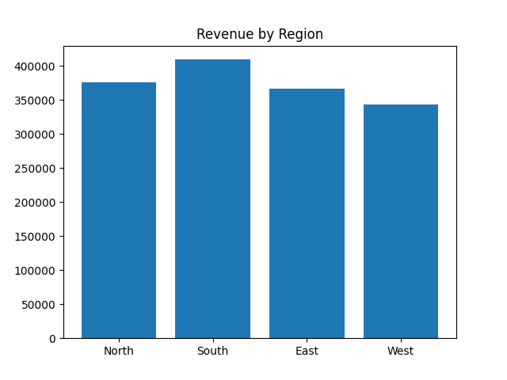
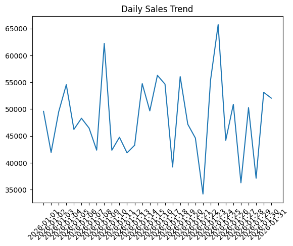

# 📄 PDF Report Generator with Templating

## 🚀 Overview

The **PDF Report Generator** is a Python-based automation system that extracts structured sales data from a database, processes it, visualizes insights using charts, and generates a **professional PDF report**.

The generated report is automatically emailed to stakeholders, making it ideal for **business reporting and analytics workflows**.

---

## 🎯 Features

* 📊 Automated monthly report generation
* 📈 Data visualization using charts
* 🧾 Template-based HTML rendering (Jinja2)
* 📄 PDF generation (ReportLab)
* 📧 Email delivery with attachments
* ⚠️ Conditional alerts (e.g., declining regions)
* 🧱 Modular and scalable architecture

---

## 🛠️ Tech Stack

| Category      | Technology Used    |
| ------------- | ------------------ |
| Language      | Python             |
| Database      | SQLite (`sqlite3`) |
| Templating    | Jinja2             |
| Charts        | Matplotlib         |
| PDF Generator | ReportLab          |
| Email Service | SMTP (`smtplib`)   |
| File Handling | Pathlib            |

---

## 📂 Project Structure

```txt
task-13/
│
├── generate_report.py
├── sales.db
├── templates/
│   └── sales_monthly.html
├── charts/
│   ├── region_chart.png
│   └── daily_chart.png
├── reports/
│   └── sales_report_YYYY-MM.pdf
```

---

## ⚙️ How It Works

### 1️⃣ Data Extraction

* Connects to SQLite database
* Fetches monthly sales data

```sql
SELECT date, region, revenue, units
FROM sales
WHERE strftime('%Y-%m', date) = ?
```

---

### 2️⃣ Data Processing

Calculates:

* Total Revenue
* Total Units Sold
* Average Order Value
* Region-wise Revenue
* Daily Sales Trends

---

### 3️⃣ Chart Generation

* 📊 Bar Chart → Revenue by Region
* 📈 Line Chart → Daily Sales Trend

Saved in:

```txt
charts/region_chart.png
charts/daily_chart.png
```





---

### 4️⃣ Template Rendering (Jinja2)

Dynamic HTML template includes:

* Summary metrics
* Charts
* Conditional warning

```html

⚠ {{ warning }}

```

---

### 5️⃣ PDF Generation

* Uses **ReportLab**
* Converts processed data into a structured PDF

Includes:

* Title
* Summary
* Charts

---

### 6️⃣ Email Automation

* Sends PDF as an attachment
* Supports multiple recipients

---

## ▶️ Usage

Run the script with a specific month:

```bash
python generate_report.py --month 2026-01
```

---

## ✅ Sample Output

```txt
=== Report Generation ===
[1/5] Connecting to database... OK
[2/5] Querying 2026-01 sales data... OK (124 records)
[3/5] Rendering template "sales_monthly"...
[4/5] Generating PDF... OK
[5/5] Sending email... Sent successfully

Output: reports/sales_report_2026-01.pdf
```

---

## ⚠️ Conditional Alerts Example

```python
if "West" in data["region_data"]:
    warning = "West region declined 12% MoM"
```

---

## 🔒 Security Note

⚠️ Do NOT hardcode credentials in production:

```python
smtp.login("email", "password")
```

### ✅ Recommended:

* Use environment variables
* Use app passwords
* Use secret managers

---

## 💡 Use Cases

* Business reporting systems
* Sales analytics
* Automated reporting pipelines
* IoT & industrial dashboards
* Enterprise reporting tools

---

## 🧠 Learning Outcomes

* Data pipeline design
* Template rendering (Jinja2)
* PDF generation workflows
* Data visualization
* Backend automation
* Email integration
